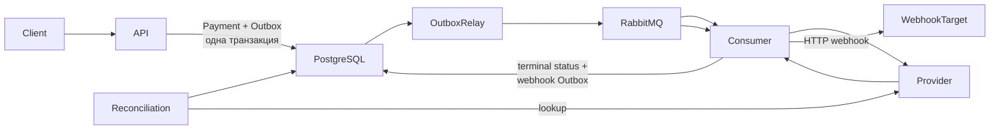

# Async Payment Processing

Асинхронный сервис обработки платежей на FastAPI, PostgreSQL и RabbitMQ.

Проект реализует создание платежа через HTTP API и его последующую асинхронную обработку с использованием Transactional Outbox, идемпотентности, retry/DLQ, webhook delivery и reconciliation для неоднозначных результатов внешнего провайдера.

## Стек

- Python 3.14
- FastAPI
- Pydantic v2
- SQLAlchemy 2.0 async
- PostgreSQL 17
- RabbitMQ + FastStream
- Alembic
- httpx
- Docker / Docker Compose
- Poetry
- pytest
- Ruff
- Pyright

## Архитектура



Основной поток:

1. Клиент вызывает `POST /api/v1/payments`.
2. API атомарно сохраняет `Payment` и событие в Outbox.
3. Outbox Relay публикует событие `payment.process_requested` в RabbitMQ.
4. Consumer получает событие и вызывает внешний payment provider.
5. После подтверждённого результата платеж становится `succeeded` или `failed`.
6. В той же транзакции создаётся Outbox-событие для webhook.
7. Consumer доставляет webhook клиенту.
8. Неоднозначный результат provider-вызова переводит платеж во внутренний статус `unknown`.
9. Reconciliation Worker позже запрашивает provider по idempotency key и завершает платеж.

Сервис использует at-least-once delivery. Повторная доставка сообщений учитывается бизнес-логикой и идемпотентностью.

## Быстрый запуск

Для запуска всего проекта достаточно Docker и Docker Compose.

```bash
git clone https://github.com/ForerunnerDeath/async-payment-processing.git
cd async-payment-processing

docker compose up --build -d --wait
```

`.env` для стандартного Docker-запуска не требуется.

Проверка readiness:

```bash
curl \
  -H "X-API-Key: local-dev-api-key" \
  http://localhost:8000/health/ready
```

## Порты

При запуске без `.env`:

| Сервис | Адрес |
|---|---|
| API | `http://localhost:8000` |
| Swagger UI | `http://localhost:8000/docs` |
| ReDoc | `http://localhost:8000/redoc` |
| Mock payment provider | `http://localhost:8001` |
| PostgreSQL | `localhost:5432` |
| RabbitMQ AMQP | `localhost:5672` |
| RabbitMQ Management | `http://localhost:15672` |

Значения можно переопределить через `.env`. Пример находится в `.env.example`.

## Авторизация

Прикладные HTTP endpoints защищены статическим заголовком:

```text
X-API-Key
```

Для стандартного локального Docker-запуска:

```text
X-API-Key: local-dev-api-key
```

При использовании `.env` значение задаётся через:

```text
API_KEY
```

## API

### Создание платежа

```http
POST /api/v1/payments
```

Обязательные заголовки:

```text
X-API-Key: local-dev-api-key
Idempotency-Key: unique-payment-key
Content-Type: application/json
```

Пример:

```bash
curl -X POST \
  http://localhost:8000/api/v1/payments \
  -H "X-API-Key: local-dev-api-key" \
  -H "Idempotency-Key: order-123" \
  -H "Content-Type: application/json" \
  -d '{
    "amount": "1500.50",
    "currency": "RUB",
    "description": "Order 123",
    "metadata": {
      "order_id": "123"
    },
    "webhook_url": "https://example.com/webhook"
  }'
```

Ответ `202 Accepted`:

```json
{
  "payment_id": "aaaaaaaa-aaaa-aaaa-aaaa-aaaaaaaaaaaa",
  "status": "pending",
  "created_at": "2026-09-26T08:00:00Z"
}
```

Поддерживаемые валюты:

- `RUB`
- `USD`
- `EUR`

### Получение платежа

```http
GET /api/v1/payments/{payment_id}
```

Пример:

```bash
curl \
  -H "X-API-Key: local-dev-api-key" \
  http://localhost:8000/api/v1/payments/aaaaaaaa-aaaa-aaaa-aaaa-aaaaaaaaaaaa
```

Публичные статусы:

```text
pending
succeeded
failed
```

Внутренний статус `unknown` наружу не публикуется. Пока reconciliation не установил конечный результат, такой платеж отображается клиенту как `pending`.

## Идемпотентность API

`POST /api/v1/payments` требует `Idempotency-Key`.

Поведение:

- первый запрос создаёт `Payment` и Outbox event;
- повторный запрос с тем же ключом и тем же payload возвращает существующий платеж;
- повторный запрос с тем же ключом, но другим payload возвращает `409 Conflict`;
- конкурентное создание с одним ключом защищено UNIQUE constraint и повторным чтением существующего платежа.

Для сравнения запросов используется fingerprint значимых полей платежа.

## Transactional Outbox

Создание платежа и создание события выполняются в одной PostgreSQL-транзакции.

Таким образом исключается сценарий:

```text
Payment сохранён
RabbitMQ publish потерян
```

Outbox Relay:

1. читает неопубликованные события;
2. публикует их в RabbitMQ;
3. ждёт publisher confirm;
4. только после успешной публикации отмечает событие опубликованным.

Crash между успешным broker publish и фиксацией `published_at` может привести к повторной публикации. Это соответствует выбранной at-least-once модели доставки.

## RabbitMQ

Основной exchange:

```text
payments
```

Очереди:

```text
payments.new
payments.retry.1
payments.retry.2
payments.dlq
```

Retry выполняется через TTL + dead-letter routing:

```text
attempt 1
    ↓ failure
payments.retry.1
    ↓ 1 second
payments.new

attempt 2
    ↓ failure
payments.retry.2
    ↓ 2 seconds
payments.new

attempt 3
    ↓ failure
payments.dlq
```

Consumer использует manual acknowledgement.

Сообщение подтверждается только после определённого результата обработки:

- success -> ACK;
- retry успешно опубликован -> ACK исходного сообщения;
- permanent failure / exhausted attempts -> reject -> DLQ;
- если публикация retry сама завершилась ошибкой -> NACK исходного delivery.

Это предотвращает зависание неожиданной ошибки в `messages_unacknowledged` до рестарта consumer.

## Payment provider

Внешний provider вызывается с idempotency key, равным UUID платежа.

Mock provider включён в Docker Compose и имитирует внешний платёжный сервис.

Обычный режим:

- задержка обработки 2-5 секунд;
- 90% платежей approved;
- 10% declined.

Внутри проекта также доступны детерминированные сценарии для тестирования:

- `approved`
- `declined`
- `error-before-processing`
- `timeout-before-processing`
- `timeout-after-processing`
- `malformed-response`

Provider client различает безопасные для повторения и неоднозначные ошибки.

Безопасные HTTP retry используют exponential backoff с full jitter, поддерживают `Retry-After` для `429/503` и ограничены общим retry time budget.

Например:

- connection failure до подтверждённой отправки может быть retryable;
- timeout/read/write/protocol failure после возможной отправки POST считается ambiguous;
- ambiguous outcome не приводит к слепому повторению опасной операции, а переводит платеж во внутренний `unknown`.


## Circuit Breaker

Вызовы payment provider дополнительно защищены Circuit Breaker со состояниями:

`CLOSED -> OPEN -> HALF_OPEN -> CLOSED`

По умолчанию breaker открывается после 5 последовательных provider failures и через 15 секунд разрешает пробный вызов.

Ошибки недоступности и неоднозначные provider failures учитываются как failures Circuit Breaker. Детерминированный permanent response провайдера не считается outage и не открывает breaker.

Если Circuit Breaker открыт, новый HTTP-вызов к provider не выполняется, а событие считается retryable и проходит через обычный RabbitMQ retry flow.

Параметры:

- `PAYMENT_PROVIDER_CIRCUIT_BREAKER_FAILURE_THRESHOLD`
- `PAYMENT_PROVIDER_CIRCUIT_BREAKER_RECOVERY_TIMEOUT_SECONDS`


## Reconciliation

Для платежей с неоднозначным provider outcome используется отдельный reconciliation worker.

Он:

1. находит stale `unknown` платежи;
2. атомарно claim'ит их через lease;
3. запрашивает provider по стабильному idempotency key;
4. переводит платеж в `succeeded` или `failed`;
5. создаёт webhook Outbox event.

Lease предотвращает одновременную reconciliation одного платежа несколькими worker'ами.

После исчерпания reconciliation budget платеж помечается как требующий manual review.

## Webhooks

После терминального статуса отправляется webhook.

Типы событий:

```text
payment.succeeded
payment.failed
```

Пример payload:

```json
{
  "event_id": "bbbbbbbb-bbbb-bbbb-bbbb-bbbbbbbbbbbb",
  "event_type": "payment.succeeded",
  "payment_id": "aaaaaaaa-aaaa-aaaa-aaaa-aaaaaaaaaaaa",
  "status": "succeeded",
  "amount": "1500.50",
  "currency": "RUB",
  "processed_at": "2026-09-26T08:00:05Z",
  "metadata": {
    "order_id": "123"
  }
}
```

Дополнительные заголовки:

```text
X-Webhook-Id
X-Webhook-Attempt
```

Retryable webhook failures:

- network errors;
- `408`;
- `429`;
- `5xx`.

Другие `4xx` считаются permanent failure.

Webhook delivery имеет тот же bounded RabbitMQ retry flow с DLQ.

Ошибка доставки webhook не изменяет уже подтверждённый статус платежа.

## Health checks

Liveness:

```http
GET /health/live
```

Readiness:

```http
GET /health/ready
```

Оба endpoint требуют `X-API-Key`.

Readiness проверяет доступность PostgreSQL и возвращает `503`, если база недоступна.

## Локальная разработка

Требования:

- Python 3.14
- Poetry 2.2.1
- Docker / Docker Compose

Установка зависимостей:

```bash
poetry install
```

Для запуска приложения локально вне контейнера можно создать `.env`:

```bash
cp .env.example .env
```

`.env.example` использует отдельные host-порты PostgreSQL и RabbitMQ, чтобы было удобно запускать Python-приложение с хоста.

## Миграции

В Docker миграции применяются автоматически отдельным одноразовым сервисом `migrations`.

Вручную:

```bash
poetry run alembic upgrade head
```

## Тесты

### Основной test suite

Integration tests используют настоящий PostgreSQL и RabbitMQ.

Если используется `.env.example`:

```bash
docker compose up -d postgres rabbitmq
poetry run alembic upgrade head
poetry run pytest
```

Важно: во время integration suite Docker-сервис `consumer` не должен быть запущен, поскольку тесты самостоятельно потребляют сообщения из тех же RabbitMQ queues.

Если полный stack уже был поднят:

```bash
docker compose stop api consumer
poetry run pytest
```

Текущий основной suite включает unit и integration tests. E2E tests при обычном запуске пропускаются.

### Проверки качества

```bash
poetry run ruff check .
poetry run ruff format --check .
poetry run pyright
```

### Mock provider

```bash
cd mock-provider

poetry install
poetry run pytest
poetry run ruff check .
poetry run ruff format --check .
poetry run pyright
```

## Docker E2E

E2E tests являются black-box: они не импортируют бизнес-логику приложения и работают с системой через HTTP.

Покрыты три детерминированных сценария:

1. `approved -> succeeded -> webhook`;
2. `declined -> failed -> webhook`;
3. `timeout-after-processing -> internal unknown -> reconciliation -> succeeded -> webhook`.

Поднять ускоренный E2E stack:

```bash
docker compose \
  -f docker-compose.yml \
  -f docker-compose.e2e.yml \
  up --build -d --wait
```

`docker-compose.e2e.yml` изменяет только интервалы и timeout'ы, необходимые для быстрого детерминированного E2E-прогона.

## CI

GitHub Actions запускается на push, pull request и вручную через `workflow_dispatch`.

Pipeline состоит из трёх независимых уровней:

### App checks

- PostgreSQL service
- RabbitMQ service
- Alembic migrations
- Ruff
- Ruff format check
- Pyright strict
- unit + integration tests

### Mock provider checks

- Ruff
- Ruff format check
- Pyright strict
- mock-provider tests

### Docker E2E

После успешных первых двух jobs:

- собирается полный Docker Compose stack;
- запускаются миграции;
- поднимаются API, consumer, PostgreSQL, RabbitMQ и mock-provider;
- запускаются три black-box E2E сценария.

## Структура проекта

```text
app/
├── api/                    HTTP API и dependencies
├── clients/                payment provider и webhook clients
├── core/                   config, database, logging, middleware
├── integrations/rabbitmq/  broker, topology, publisher
├── models/                 SQLAlchemy models
├── repositories/           database access
├── resilience/             circuit breaker
├── schemas/                Pydantic schemas
├── services/               Outbox, payment creation, reconciliation
└── worker/                 consumer, dispatcher, processors

alembic/                     database migrations
mock-provider/               deterministic external provider
tests/
├── unit/
├── integration/
└── e2e/

docker-compose.yml
docker-compose.e2e.yml
```

## Надёжность и consistency

Ключевые решения проекта:

- Transactional Outbox для DB -> RabbitMQ consistency;
- уникальный `Idempotency-Key` для API;
- стабильный payment UUID как provider idempotency key;
- publisher confirms;
- manual RabbitMQ ACK/NACK;
- bounded retry + DLQ;
- отдельная обработка permanent, retryable и ambiguous failures;
- внутренний `unknown` для неоднозначного provider outcome;
- reconciliation вместо потенциально опасного повторного POST;
- webhook idempotency через стабильный event ID;
- database locking для конкурентных изменений состояния;
- reconciliation leases;
- HTTP-вызовы выполняются вне database transaction;
- Circuit Breaker для защиты provider integration при серии сбоев;
- structured JSON logging через `structlog`;
- request correlation через `X-Request-ID`;
- at-least-once delivery как осознанная модель.

## Ограничения и допущения

Это тестовый сервис, а не готовая публичная платёжная платформа.

В частности:

- используется статический API key вместо полноценной identity/auth системы;
- `/docs`, `/redoc` и `/openapi.json` оставлены доступными для удобства проверки проекта; прикладные endpoints защищены API key;
- `webhook_url` считается доверенным входом от авторизованного клиента;
- production-система должна дополнительно защищаться от SSRF через allowlist и/или проверку resolved IP с учётом DNS rebinding;
- mock-provider и его `/test/*` endpoints предназначены только для development/test environment;
- worker health endpoint отдельно не реализован;
- доставка имеет семантику at-least-once, поэтому consumers и внешние integrations должны учитывать возможные duplicates.
